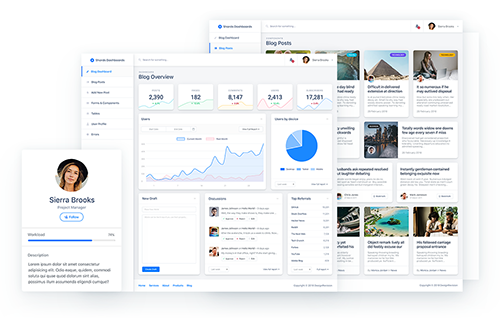
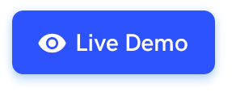
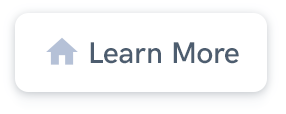
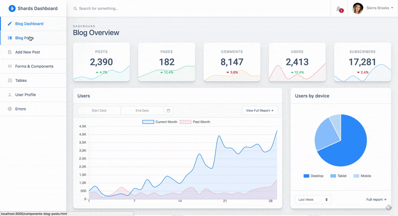

<h1 align="center" style="border-bottom: none !important; margin-bottom: 5px !important;"><a href="https://designrevision.com/downloads/shards-dashboard-lite-react/">Shards Dashboard React</a></h1>

  
  

A free React admin dashboard template pack featuring a modern design system    and lots of custom templates and components.

  
  

 

 

> ✨ **Note:** You can download the Sketch files from the official product page.

 

### Quick Start

* Install dependencies by running `yarn` or `npm install`.
* Run `yarn start` or `npm run start` to start the local development server.
* 😎 **That's it!** You're ready to start building awesome dashboards.

 

### Project Structure

- This project is bootstrapped using [Create React App](https://github.com/facebook/create-react-app).
- **Flux** is used for state management and all Flux specific files are located inside `src/flux`. Transitioning to a more robust solution such as Redux is also fairly simple.
- All primary templates are located inside `src/views`.
- There is only one single layout defined (Default) inside `src/layouts`, however, the current structure provides an easy way of extending the UI kit. 
- The `src/components` directory hosts all template-specific subcomponents in their own subdirectory.
- The layout styles inherited from Shards Dashboard are pulled in from the `src/shards-dashboard` submodule inside `src/App.js`.
- Other extra styles specific to the libraries used are located inside `src/assets`.
- The `src/utils` directory contains generic Chart.js utilities.

 

### Available Scripts

### `npm start`

Runs the app in the development mode.

### `npm test`

Launches the test runner in the interactive watch mode.

### `npm run build`

Builds the app for production to the `build` folder.

### `npm run eject`

**Note: this is a one-way operation. Once you `eject`, you can’t go back!**

If you aren’t satisfied with the build tool and configuration choices, you can `eject` at any time. This command will remove the single build dependency from your project.

 

### 🌟 Pro Version

If you're looking for something more, check out [Shards Dashboard Pro React](https://designrevision.com/downloads/shards-dashboard-pro-react/) which features many more custom templates and components. Use the `GITHUB15` coupon code for a **15% discount off the current price**.

 

### Built using

- [Shards React](https://github.com/designrevision/shards-react)
- [Chart.js](https://www.chartjs.org/)
- [Flux](https://facebook.github.io/flux/)
- [No UI Slider](https://refreshless.com/nouislider/)
- [React Datepicker](https://www.npmjs.com/package/react-datepicker)
- [Quill](https://quilljs.com/)

 

### Changelog

Please check out the [CHANGELOG](CHANGELOG.md).
